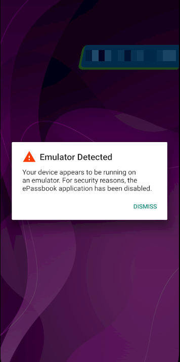
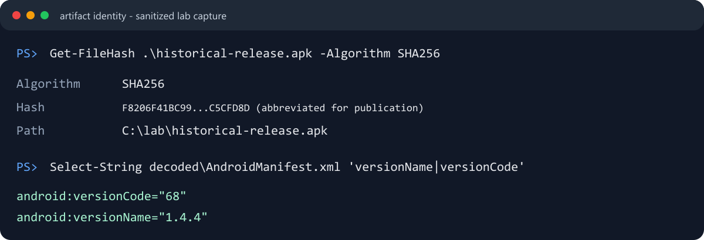
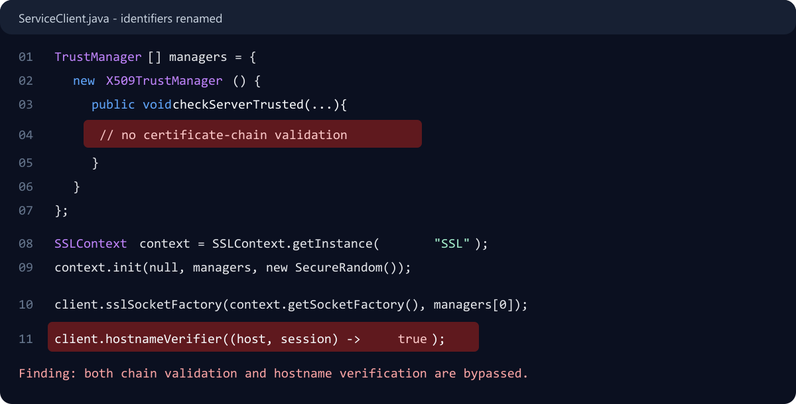
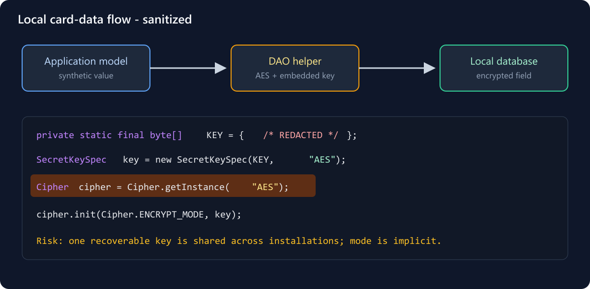
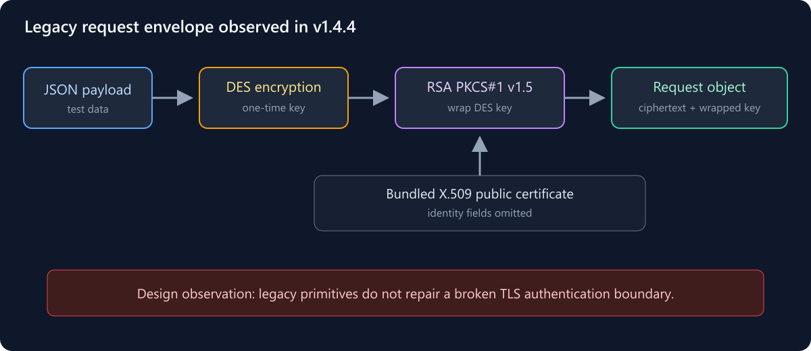

> This an old story of mine, that is about an Android release from one of the most famous banks in Sri Lanka that I studied in my own lab. I have removed the bank's name, package name, servers, API paths, credentials, certificate details, and all personal data. I used only my own test environment and test data. This is **not** a review of the current version of the app.

## Background

I’m a big believer in open-source software, and I’m careful about installing closed-source apps on my phone. That is why I replaced the stock operating system on my Pixel with GrapheneOS. I love it. 

But, that decision came with a price: none of my bank’s apps would run.

I called them, I emailed them. But, they didn't response to me at all. So, naturally, I decided to take matters into my own hands. 😤

My goal was to understand how the app worked under the hood, map how it communicated with its backend, and explore whether I could build a safe, much better integration for my own use.

During the process, I thought, “Why not perform a security analysis of the application while I’m at it?”

Let's dive in.

## Approach

First, I downloaded and installed the app in my lab environment.



Of course, it immediately detected the emulator and refused to continue.

Before touching the APK, I recorded its version and hash. This sounds boring, but it prevents a common mistake: analyzing one file and later writing about another.

```powershell
Get-FileHash .\base.apk -Algorithm SHA256
Select-String -Path .\decoded\AndroidManifest.xml -Pattern 'versionName|versionCode'
```

I kept the full hash in my private notes. The screenshot below shows only part of it because a complete APK hash can sometimes be used to identify the original application.



At this point, I had no finding. I only had a clearly identified target and a question: **what is this app doing behind the screens I can see?**

### Opening the app without its source code

I used two tools to unpack it:

```bash
apktool d -f base.apk -o decoded
jadx -d decompiled base.apk
```

`apktool` gave me the manifest and Android resources. `jadx` turned the DEX bytecode into Java-like code that was much easier to browse.

The result was a huge directory containing app code, Android support code, and many third-party libraries. Searching everything at once produced a lot of noise, so I first found the app's own namespace and focused on that.

I roughly mapped it like this:

```text
application/
|-- data/dao/          local database code
|-- network/remote/    API clients
|-- network/security/  encryption helpers
`-- ui/                screens and user flows
```

That small map helped a lot. Instead of wandering through thousands of files, I could follow a piece of data from a screen, into a service or database helper, and back again.

For the first pass, I searched for a few security-related words:

```bash
rg -n -S \
  'HostnameVerifier|X509TrustManager|Cipher\.getInstance|SecretKeySpec|Authorization|Log\.' \
  decompiled/sources
```

This command did not prove anything. It only gave me places to investigate.

## Findings
### TLS checks that always passed

As the first strange that I found: One search result led me into the network-client code. There I found a custom certificate trust manager. Its `checkServerTrusted` method was empty.

Then, a few lines later, I found a hostname verifier that simply returned `true`.

```java
public void checkServerTrusted(X509Certificate[] chain, String authType) {
    // nothing happens here
}

client.hostnameVerifier((host, session) -> true);
```



This was the moment the project became more than code browsing.

Normally, HTTPS checks two important things: whether the certificate can be trusted, and whether it belongs to the server the app wanted to reach. Here, the custom code weakened both checks.

I found the same pattern in four of the app's own service clients. I then followed where those clients were created and confirmed that they were connected to real app flows. That step mattered because decompiled applications often contain unused code and library code. A scary-looking function is not automatically a real finding.

I did not include server names, endpoints, or instructions for intercepting the traffic. They are not needed to explain the lesson: **custom TLS code is dangerous when it quietly turns verification off.**

### Then I found credentials inside the client

While following the service calls, I noticed several strings beginning with `Basic`.

They were HTTP Basic Authorization values. Some were labelled for different environments, and a production-labelled value was passed into several API calls.

The real values are removed here:

```java
private static final String CLIENT_AUTH = "Basic [REDACTED]";

api.register(CLIENT_AUTH, request);
```

This taught me a simple but important rule: **if a secret is shipped inside an APK, it is no longer a secret.**

Base64 does not change that. Obfuscation does not change it either. Both may make a value less obvious, but the phone still needs to recover and use it.

I could prove that the credentials existed and were used by the app. I could not prove, from client code alone, what the server would allow someone to do with them. That depends on server-side authentication and authorization, which were outside my view. So I kept the claim narrow instead of turning it into a bigger story than the evidence supported.

### Following card data into the local database

My next question was about storage. What did the app keep on the device, and how was it protected?

The local database code passed card numbers through an AES helper before saving them. At first, that sounded good. Then I opened the helper.

```java
private static final byte[] KEY = { /* REDACTED */ };

SecretKeySpec key = new SecretKeySpec(KEY, "AES");
Cipher cipher = Cipher.getInstance("AES");
```

The AES key was a fixed byte array inside the APK. The same public APK that contained the encrypted database logic also contained the material needed to reproduce the encryption.



There was another detail: the code requested only `AES`, without naming a mode or padding. On common Android and Java providers, that falls back to an ECB-style default. It is better to request the complete transformation explicitly, but the bigger problem here was the shared, recoverable key.

I traced both directions:

```text
card value -> encrypt helper -> database
database -> decrypt helper -> card model
```

For verification, I used a copied database and my own synthetic records. I started with the schema rather than dumping every row:

```bash
cp passbook_database passbook_database.lab-copy
sqlite3 passbook_database.lab-copy '.tables'
```

I am deliberately not publishing the database, the AES key, my decryption script, or any recovered value.

The safer design would be to avoid storing a full card number if a masked value or token is enough. If the app truly needs reversible local encryption, a per-install key stored in Android Keystore and an authenticated mode such as AES-GCM would be a much stronger starting point.

### The logs were telling their own story

While tracing the database code, I saw this kind of statement:

```java
Log.d("APP", "decrypted: " + sensitiveValue);
```

Similar logging appeared around request and response handling.

This is easy to overlook because logging feels temporary. But once plaintext is written to a log, it has stepped outside the protection offered by database encryption or HTTPS.

I tested this with obvious fake values on my own device so I could recognize them safely:

```bash
adb logcat --clear
adb shell pidof com.example.redacted
adb logcat --pid=<PID>
```

Whether every log line is visible depends on the Android version, build configuration, device state, and the exact app flow. The code was definitely present; the real-world exposure could vary. That distinction is important when writing a finding.

### One final rabbit hole: the custom encryption envelope

The app did not rely only on HTTPS. Before sending some JSON requests, it also built its own encrypted envelope.

The process looked like this:

1. Generate a one-time DES key.
2. Encrypt the JSON payload with DES.
3. Wrap the DES key with an RSA public key bundled in the APK.
4. Send the encrypted message, wrapped key, and a hash together.



This was interesting from a reverse-engineering point of view because I had to follow several helpers before the full design became visible.

DES is now obsolete because of its small effective key size. The implementation also used old-style RSA PKCS#1 v1.5 encryption. More importantly, an extra encryption layer cannot repair HTTPS when the client has disabled the checks that authenticate the server.

I inspected only non-identifying details of the bundled certificate:

```bash
base64 -d decoded/assets/public_key.der.b64 > public_key.der
openssl x509 -inform DER -in public_key.der \
  -noout -dates -fingerprint -sha256
```

I intentionally left `-subject` and `-issuer` out of the screenshot because those fields identified the institution and an individual.

> This project started almost by accident, but it became one of my most valuable learning experiences. Along the way, I learned a lot about reverse engineering, sharpened my cryptography skills, and became much more confident navigating an unfamiliar application from the inside out. 😊
