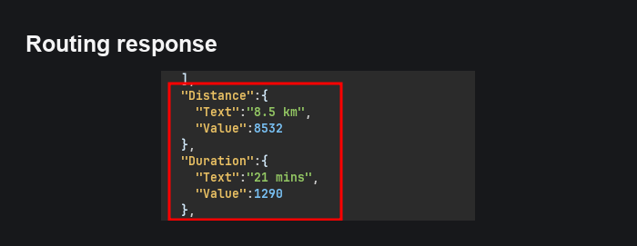
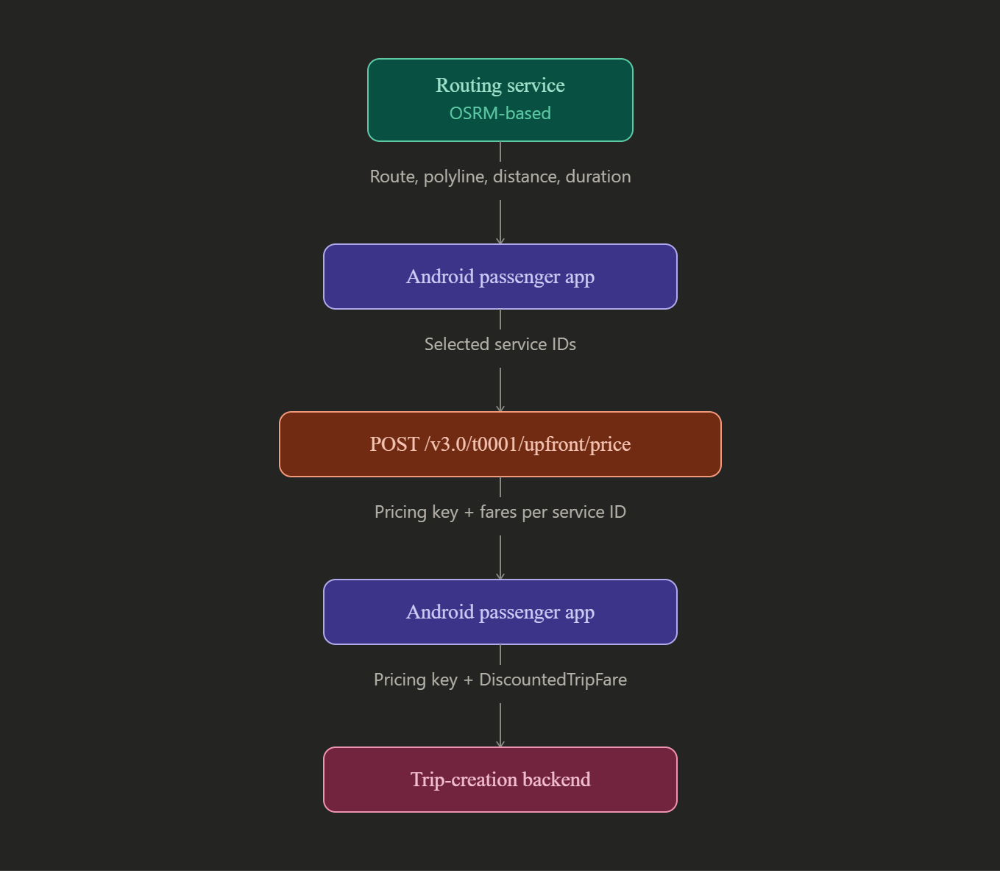
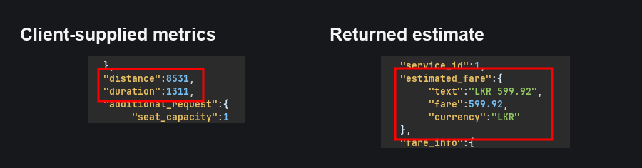
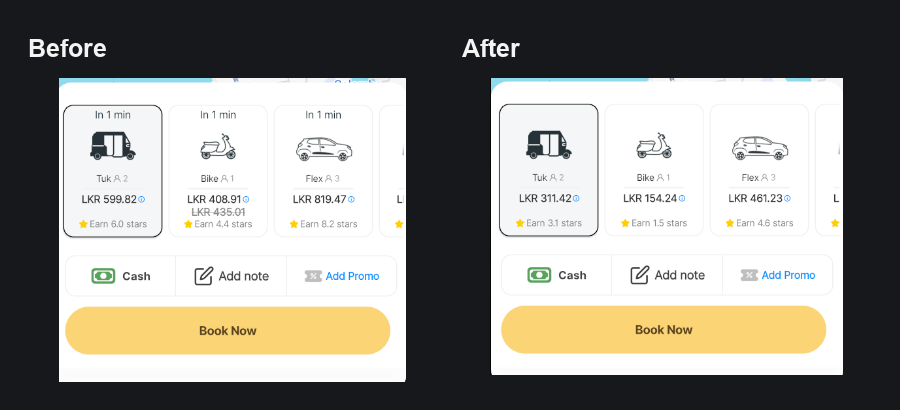
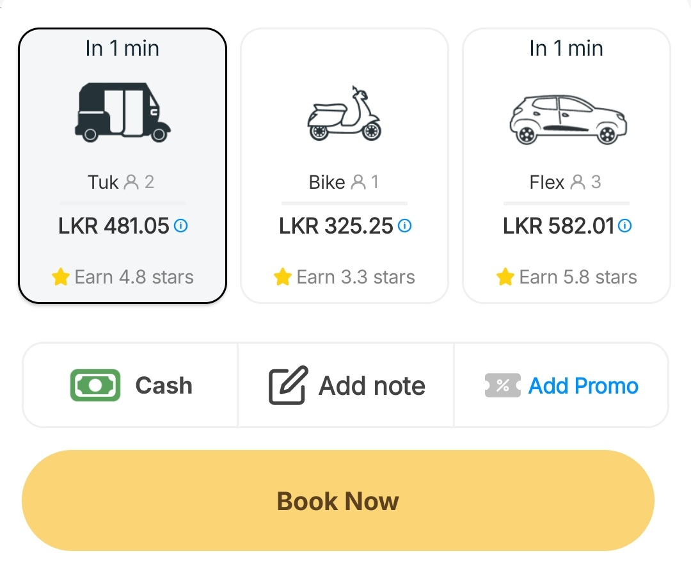
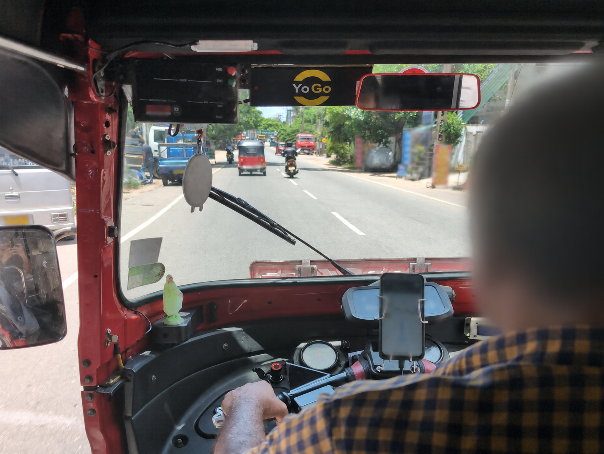
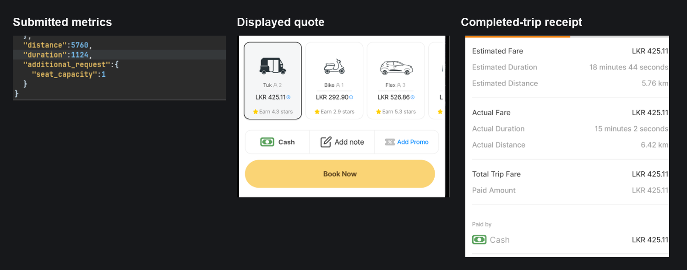

> **Responsible disclosure update (20 August 2026):** I tested only with my own PickMe account and paid rides. I reported the issue privately before writing this 
>article. PickMe has since fixed this issue, I have decided to tell the story.

## Background

Like a lot of people in Sri Lanka, I use PickMe without thinking too much about what happens after I enter two locations.
The map draws a line. A few vehicle options appear. Each one gets a price. I pick one and move on with my day.

But one day, I thought I'd roll up my sleeves and understand what's going on behind the scenes.
At first, It was a very boring reverse engineering process. Everything is obfuscated and heavily guarded.
However, I stumbled across an interesting request on BurpSuite. 
```text
@POST `/v3.0/t0001/upfront/price` HTTP/2
```

Then I asked myself:
**Who tells the pricing system how long the journey is?**

At first, I expected the answer to be cut and dried. Surely the server calculated the route and kept the important numbers to itself.
It did not quite work that way.

The app received the route distance and duration, carried those values through several layers of Android code, and sent them back to the pricing service as normal request fields.
That was the moment the penny dropped, start of the rabbit hole. 

## Opening the APK

I began with the PickMe passenger app, version `26.070.1` (`versionCode 4012011`). I recorded the version and APK hash in my private notes before doing anything else.
That habit is worth learning early: mobile apps change quickly. If I cannot say exactly which file I examined, I can easily mix evidence from two releases and tell the wrong story.

My first attempt was to open the app in my lab environment, but I quickly hit a wall. As I mentioned earlier, the application was heavily guarded and refused to operate normally on my personal setup for several reasons:
1. It detected rooted devices.
2. It detected emulators.
3. SSL pinning blocked my traffic-inspection tools.
I had to bypass everything. Let me tell you: it was no bed of roses. Welldone PickMe. 👏

So, I unpacked the APK with two familiar tools:

```bash
apktool d base.apk -o decoded
jadx -d decompiled base.apk
```

`apktool` exposed the manifest, resources, and lower-level Smali. `jadx` reconstructed Java-like source that was much easier to read.

The word *reconstructed* matters. Decompiled code is not the developer's original source. PickMe's APK was also heavily obfuscated, so many class and method names had been shortened into things such as `a`, `b`, and `c`. Instead of trusting a single strange-looking method, I followed data through models, constructors, JSON field names, and call sites until the same story appeared in several places.

I started at the ride-confirmation screen, where the route and the prices finally meet.

## Following two ordinary numbers

The app first asked a mapping service for a route. The response contained a polyline for drawing the path, plus two numbers:

- `distance`, measured in metres; and
- `duration`, measured in seconds.

One captured response described an `8,532 m` route expected to take `1,290 s`—about 8.5 km and 21 minutes.



So far, everything was normal.
Then I pulled on that thread, and the whole thing unravelled

The ride-confirmation view model stored the routing response. Later, the same view model pulled the distance and duration back out and passed them to the fare-estimation use case:

```java
getPriceForRide(
    serviceCode,
    vehicleIds,
    pickupLatitude,
    pickupLongitude,
    destinationLatitude,
    destinationLongitude,
    distance,
    duration,
    seatCapacity
);
```

That use case created a request object. The request builder serialized the values into JSON:

```json
{
  "service_code": "RIDES",
  "service_ids": [1, 2, 3],
  "pickup_points": { "lat": "[REDACTED]", "lon": "[REDACTED]" },
  "drop_points": { "lat": "[REDACTED]", "lon": "[REDACTED]" },
  "distance": 8531,
  "duration": 1311,
  "additional_request": { "seat_capacity": 1 }
}
```

The coordinates and service list above are shortened or redacted. The important part is that `distance` and `duration` were ordinary fields created on the passenger's phone.

The data flow now looked like this:

```text
mapping response
    -> Android view model
    -> fare-estimation object
    -> JSON request
    -> upfront-pricing service
```



### The exact code trail

If you only need the main idea, it is this: the phone received two route measurements and later sent those measurements to the pricing service. If you enjoy the reverse-engineering side, the decompiled code gave me five separate checkpoints:

| Checkpoint              | Decompiled artifact                 | What I found                                                                                            |
|-------------------------|-------------------------------------|---------------------------------------------------------------------------------------------------------|
| Route enters the app    | `RideConfirmViewModel.java`         | Reads `route.getDistance().getValue()` and `route.getDuration().getValue()`, then stores them together. |
| Fare calculation begins | `RideConfirmViewModel.java`         | Passes those integer values to `getPriceForRideUseCase`.                                                |
| Request is constructed  | `JourneyEstimationDto.java`         | Holds pickup, drop-off, distance, duration, service IDs, and seat capacity.                             |
| JSON leaves the client  | `JourneyEstimationPostRequest.java` | Serializes the DTO values as `distance` and `duration` in a `POST` request to the upfront-pricing path. |
| Quote enters booking    | `CreateTripRequest.java`            | Adds the selected quote's `Key` and `DiscountedTripFare` to the trip-creation body.                     |

The first useful fragment was inside the ride-confirmation view model. The following is lightly shortened for readability, but the calls and data types are preserved:

```java
Distance distance = rideEstimateResponse.getRoute().getDistance();
Duration duration = rideEstimateResponse.getRoute().getDuration();

getPriceForRideUseCase.a(
    serviceCode,
    activeVehicleList,
    pickupLat, pickupLon,
    dropLat, dropLon,
    distance.getValue(),
    duration.getValue(),
    1,
    continuation
);
```

The method name `a()` is a side effect of obfuscation; it does not tell us what the method does. The surrounding field name, `getPriceForRideUseCase`, its parameter types, and the object it creates are much more useful clues.

Inside that use case, the code built a `JourneyEstimationDto`. The serializer then made the client/server boundary unambiguous:

```java
jsonObject.addProperty(
    "distance",
    journeyEstimationDto.getDistance()
);
jsonObject.addProperty(
    "duration",
    journeyEstimationDto.getDuration()
);
```

On the way back, the view model extracted `data.getKey()` from the pricing response and attached it to the selected `RideEstimate` as `upfrontPricingKey`. The booking serializer later used it like this:

```java
jsonObject25.addProperty("Key", rideEstimate.getUpfrontPricingKey());
jsonObject25.addProperty("DiscountedTripFare", discountedFare);
jsonObject.add("Price", jsonObject25);
```

None of those snippets alone proved a vulnerability. Together, they showed a complete **source-to-sink trail**: route data entered at the mapping response, crossed the fare request, returned as a quote, and reached trip creation.

This was also a useful lesson about reading obfuscated applications. I did not need to recover every shortened class name. Stable clues survived: model names such as `JourneyEstimationDto`, JSON keys such as `distance`, typed getters such as `getDuration()`, and the same values appearing at multiple call sites. When names become unreliable, following data is often more productive than trying to understand the whole application at once.

This is called a **trust boundary**.

The backend belongs to the company. The phone belongs to the user. Anything that crosses from the phone to the backend must be treated as untrusted, even when the official app sent it.

A simple analogy is asking a customer to weigh their own parcel, write the weight on a note, and hand that note to the cashier. Most customers will be honest—but the cashier should still use the shop's scale.

## My first controlled test

Static analysis told me the fields came from the client. It did not tell me whether the server trusted them.

To answer that, I used my own account and captured the fare request for a test route. The baseline request sent `8,531 m` and `1,311 s`. The service returned an estimate of `LKR 599.92` for the selected vehicle type.



I repeated the request with the same coordinates and the same `1,311 s` duration. I changed only the distance:

```text
8,531 m  ->  1,531 m
```

The returned estimate fell to `LKR 311.42`.

That was the moment the finding became real. I had not changed the route on the map. I had only made the journey shorter *on paper*, and the pricing response dropped by about 48%.

The app then displayed the lower amount:



There is a small evidence detail worth being honest about. The saved baseline UI screenshot shows `LKR 599.82`, while the baseline API-response capture shows `LKR 599.92`. I cannot prove those two images came from the exact same pricing cycle, so I treat them as separate observations instead of hiding the ten-cent difference.

The stronger comparison was inside the controlled request: coordinates and duration stayed the same, the submitted distance changed, and the returned price changed materially.

But I still had an important question.

**Was this only a number on the screen, or could it survive booking?**

## Following the quote into trip creation

The pricing response returned fares plus a string called `key`. The app copied that string into the selected ride estimate under a more useful name: `upfrontPricingKey`.

When the passenger pressed **Book Now**, the trip-creation request included that pricing reference and a fare value:

```json
{
  "Price": {
    "Key": "[REDACTED PRICING REFERENCE]",
    "DiscountedTripFare": 425.11
  }
}
```

At this stage I was careful not to call the key a cryptographic signature. The client treated it as an opaque string. Only PickMe's backend knew whether it represented a stored quote, an integrity check, a pricing path, or something else.

What the APK did prove was that the result travelled farther than the price label on the screen:

```text
pricing response
    -> selected vehicle estimate
    -> pricing reference + fare
    -> trip-creation request
```

That made an end-to-end test important—but also more sensitive. A production ride involves a real driver, a real payment, and a real platform. I limited the test to my own account, booked a ride I genuinely needed, paid it, and retained only the minimum evidence needed for the report.

## Taking it out of the lab

On 19 August, I carried out more than one validation run. I kept the evidence from those runs separate because screenshots taken minutes apart can look like one continuous experiment when they are not.

Before one ordinary Tuk booking, the unmodified PickMe screen showed an upfront fare of `LKR 481.05`:



This image is useful context: it records the normal fare presented for a real trip before booking. By itself, it does **not** prove a final charge or a modified request, so I do not use it as the technical proof of the finding.

I also took a photograph during one of the paid validation rides. It changes the tone of the story in a good way. This was not only a replayed API call on a laptop; there was a real road, a real journey, and money I actually paid. The photograph has been privacy-edited to obscure the driver's identity, navigation details, number plates, and readable roadside signs.



The photograph is narrative evidence, not protocol evidence. The controlled request/response captures and completed-trip receipt below are what support the technical claim.

## The paid end-to-end test

On 19 August, I ran a second test to see whether client-supplied metrics could survive the rest of the flow.

During that run I captured an ordinary request using `6,560 m` and `924 s`. I then submitted `5,760 m` and `1,124 s`. This second test changed both values; its purpose was not to reproduce the earlier 48% reduction. Its purpose was to see whether a quote created from client-supplied route metrics could be booked and carried into the completed-trip record.

The app displayed `LKR 425.11`. The booking was accepted. I completed and paid for the ride.

The receipt recorded:

| Receipt field | Estimated  |      Acutal |
|---------------|------------|------------:|
| Fare          | LKR 425.1  |  LKR 425.11 |
| Duration      | 15 min 2 s | 18 min 44 s |
| Distance      | 6.42 km    |     5.76 km |



The `5.76 km` and `18 min 44 s` on the receipt match the submitted `5,760 m` and `1,124 s`. The final fare also matched the upfront `LKR 425.11` quote.

This confirmed that, in this test, the client-supplied metrics influenced a quote that survived trip creation and appeared in the final paid trip.

Look, I know it's just a drop in the bucket `LKR 50`. I could have cross the line and trick the algorithm 😉, but that wasn't the point. I just wanted to see if the hole was real.

This does not mean that every changed value would work, that all service types behaved the same way, or that the driver was underpaid. Each of those claims would need separate evidence.
The first test showed that reducing the distance could lower the fare. The second test showed that a fare based on client-supplied distance and duration could remain unchanged after the ride was completed.

## Reporting it to PickMe

I prepared a confidential report dated 16 August 2026. It included the affected app version, APK hash, decompiled data flow, request and response evidence, the controlled comparison, and recommended server-side checks.

I also separated the claims into three levels:

1. **Confirmed:** the Android client supplied distance and duration to pricing.
2. **Confirmed:** changing those values changed the returned estimate.
3. **Confirmed in my paid test:** a quote based on the submitted values survived booking and appeared on the completed-trip receipt.

I sent the report privately and did not publish the live host, tokens, coordinates, pricing references, account details, driver details, or trip identifiers.

PickMe investigated the report. On **20 August 2026**, PickMe updated their apps and fixed the issue.

> So, to be absolutely clear: **the issue described in this article is fixed as of 20 August 2026.** I am not claiming to know the exact server-side implementation of the fix; that code is outside the Android application and was not part of my evidence. 
>
> This began as a casual dig 🪏 to kill some time. It ended as a real security report, a responsible fix, and one of the clearest lessons I have had about trust boundaries in mobile applications. 😊
